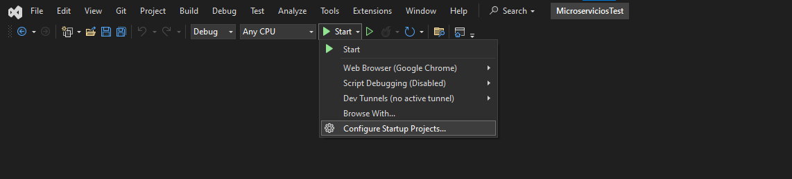
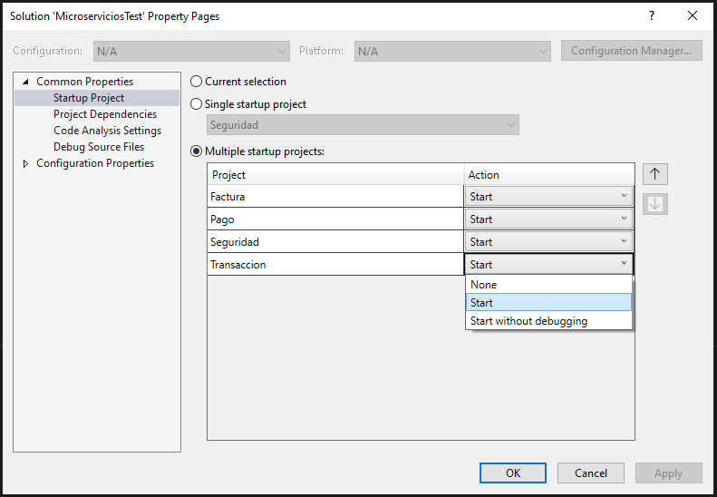
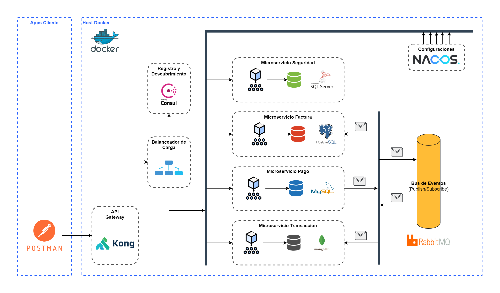

# Proyecto de Microservicios para la Capacitacion por Grupos

## Ejecucion de la solucion

Debe configurar la inicializacion de todas las soluciones





## Ejercicio de Integracion de Microservicios



### Construir una solucion con el nombre `CapacitacionMicroserviciosNET` y crear dentro de esta los siguientes proyectos:

- `Seguridad`: Responsable del token de acceso
- `Factura`: Responsable de listar las facturas de clientes
- `Pago`: Responsable de pagar una factura
- `Transaccion`: Responsable de listar las transacciones de una factura
- `Gateway`: Responsable de enmascarar las rutas del proyecto

### Crear las siguientes bases de datos:

- SQL SERVER: Para seguridad.
- POSTGRES: Para las facturas
- MYSQL: Para pagos
- MONGODB: Para transacciones

Las bases de datos tendran estos modelos

#### SQL SERVER

- BD: db_seguridad
- TABLA: usuarios
- CAMPOS:
  - id_usuario int primary key
  - nombre varchar
  - contrasena varchar

#### POSTGRES

- BD: db_factura
- TABLA: facturas
- CAMPOS:
  - id_factura int primary key
  - monto decimal
  - estado int

#### MYSQL

- BD: db_pago
- TABLA: pagos
- CAMPOS:
  - id_pago int primary key
  - id_factura int
  - monto decimal
  - fecha DateTime

#### MONGO (NO REQUIERE SCRIPT)

- BD: db_transaccion
- CAMPOS:
  - id ObjectId
  - id_transaccion int
  - id_factura int
  - monto decimal
  - fecha DateTime

### Crear las siguientes componentes:

- Una red de Docker llamada: `mi-red`
- Un servicio de configuracion centralizada llamado: `nacos-service`
- Un servicio de colas llamado: `rabbitmq-service`
- Un servicio de registro y descubrimiento llamado: `consul-service`
- Un servicio de balanceo llamado: `fabio-service`
- El microservicio de seguridad dockerizado se llamara: `app-securidad`
- El microservicio de invoces dockerizado se llamara: `app-factura`
- El microservicio de pagos dockerizado se llamara: `app-pago`
- El microservicio de transacciones dockerizado se llamara: `app-transaccion`
- El Gateway dockerizado se llamara: `app-gateway`

Todos los servicios deben correr sobre la red: `mi-red`

### Flujo del proyecto

- El microservicio de `Seguridad` debe generar un token de acceso para los microservicios de `Factura`, `Pago` y `Transaccion`.
- El `Gateway` se encargará de enmascarar las rutas de los servicios, proporcionar una capa adicional de seguridad y dirigir las solicitudes al `Balanceador` de carga, que determinará a qué contenedor enviar la información en función de su carga y disponibilidad. Todas las solicitudes deben pasar a través del balanceador.
- El microservicio de `Factura` debe tener la capacidad de listar las facturas de los clientes y, además, consumir una cola para actualizar el estado de la factura cuando se realice un pago a través del microservicio de `Pago`.
- El microservicio de `Pago` debe encargarse de registrar los pagos en su propia base de datos y enviar un mensaje a una cola para actualizar la factura en el microservicio de `Factura`. También debe dejar un mensaje en otra cola para registrar la transacción en el microservicio de `Transaccion`.
- El microservicio de `Transaccion` debe ofrecer la funcionalidad de listar las transacciones asociadas a una factura y, además, consumir una cola para obtener las transacciones de pago provenientes del microservicio de `Pago`.
- Todos los microservicios deben obtener su cadena de conexión desde un servicio de configuración centralizado.

## Instrucciones

1. Correr los Contenedores de Bases de Datos

```bash
docker-compose -f ./docker-compose-base-datos.yml up -d
```

2. Correr los Contenedores de los Servicios

```bash
docker-compose -f ./docker-compose-servicios.yml up -d
```

3. Ingresar a `RabbitMQ` [http://localhost:15672/](http://localhost:15672/)

```txt
username: Mellizo55
password: Mellizo55
```

4. API Gateway

```bash
docker-compose -f docker-compose-gateway.yml up -d
```

5. Ingresar a: [http://localhost:8001/consumers/login_fermelli_issuer/jwt/](http://localhost:8001/consumers/login_fermelli_issuer/jwt/) para obtener el `issuer` para autenticar al usuario.

```json
{
  "next": null,
  "data": [
    {
      "key": "ma2kAa5K5Rrf2YWiaiYNvK2yrRjN4Hb9", // este es el issuer
      "algorithm": "HS256",
      "secret": "Mellizo55Mellizo55",
      "id": "8d021185-fc35-4230-960b-505fb15f0610",
      "tags": null,
      "consumer": {
      "id": "b64ddbca-4ff6-599c-bb46-cf1059e1196b"
    },
    "created_at": 1692088440,
    "rsa_public_key": null
  }
]
}
```

y se lo agrega en el archivo `appsettings.local.json` de `Seguridad`

```json
{
  // ...
  "jwt": {
    "enabled": true,
    "issuer": "ma2kAa5K5Rrf2YWiaiYNvK2yrRjN4Hb9",
    "audience": "web",
    "key": "Mellizo55Mellizo55",
    "expiration": "300"
  },
  // ...
}
```

al realizar los cambios se debe reiniciar el contenedor de gateway

```bash
docker-compose -f docker-compose-gateway.yml down
docker-compose -f docker-compose-gateway.yml up -d
```

6. Ingresar a: [http://localhost:8001/consumers/anonymous_users](http://localhost:8001/consumers/anonymous_users)

7. Para ingresar a Consul: [http://localhost:8500/](http://localhost:8500/)

8. Las instancias de aplicaciones en [http://localhost:9998/routes](http://localhost:9998/routes)

9. Y para ver la configuraciones desentralizadas: [http://localhost:8848/nacos](http://localhost:8848/nacos)

ingresar con:

```txt
username: nacos
password: nacos
```

- crear el namespace: `fermelli`
- y establecer las configuraciones en ese namespace con el DATA ID: `LOCAL`